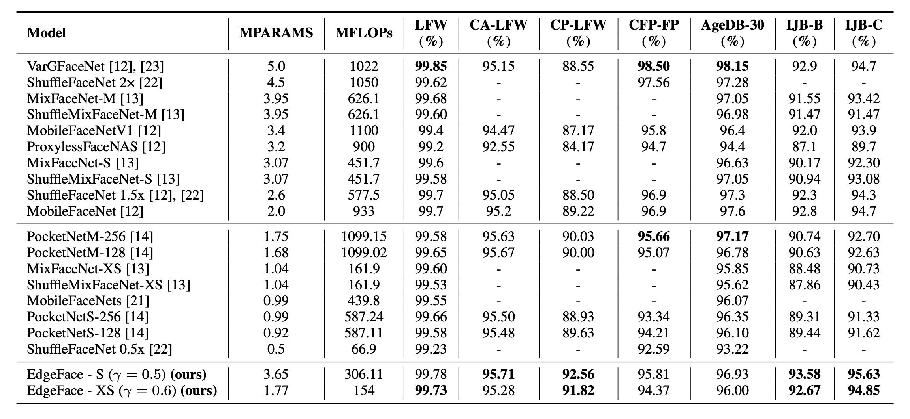

# EdgeFace: Efficient Face Recognition Model for Edge Devices

[](https://arxiv.org/abs/2307.01838v2)

This branch contains the **inference code**, a **ready-to-use API**, and **Jupyter testing notebooks** for training the **EdgeFace** model — an efficient, high-performance face recognition system designed for deployment on **edge devices**.

> This work is part of a final project for the Computer Vision course at **Egypt-Japan University of Science and Technology (E-JUST)**.

---

## Model Architecture


The **EdgeFace** model is a lightweight, mobile-friendly face recognition system built upon the **EdgeNeXt** architecture.
> The key architectural contribution of EdgeFace lies in the **replacement of standard linear layers with Low-Rank Linear (LoRALin) modules**. This optimization reduces the number of parameters in the fully connected layers while preserving model accuracy, making it especially suitable for deployment on resource-constrained devices.

The EdgeFace codebase includes:
- Pretrained weights
- Efficient training and evaluation pipelines
- Partial FC sampling for large-scale identity learning

---

## Mathematical Overview

EdgeFace maps an input image to a compact embedding vector, then uses margin-based softmax losses to make the embeddings discriminative.

### From Embeddings to Logits

Let:

* `x` ∈ ℝ¹ˣᵈ: the normalized face embedding (output of EdgeFace)
* `W` ∈ ℝᶜˣᵈ: the normalized class weight matrix (one row per identity)
* `θⱼ`: the angle between the embedding `x` and class weight `Wⱼ`

Then we compute the logits as:

```
logits = x · Wᵀ    → shape: [1, C]
```

Since `x` and `W` are both L2-normalized, the dot product is equivalent to cosine similarity:

```
logits[j] = cos(θⱼ)
```

So the output is a `[1, C]` vector of cosine similarities between the input embedding and each class prototype.

---

### Cross-Entropy Loss on Cosine Logits

After computing the cosine logits, we apply softmax and cross-entropy loss to supervise the classification.

Given:
- `z` = cosine logits (1 × C)
- `y` = index of the correct class

Softmax converts logits to class probabilities:

```

p_j = exp(z_j) / sum_k exp(z_k)

```

Then the cross-entropy loss is:

```

L = -log(p_y) = -log(exp(z_y) / sum_k exp(z_k))

```

This loss:
- Encourages the cosine similarity `z_y` for the correct class to be **maximized**
- Encourages all other class logits `z_k` where `k ≠ y` to be **minimized**

It effectively **pulls the correct embedding toward its class center** and **pushes it away from others**, creating angular separation on the hypersphere.

---
### Applying Margins to the Ground-Truth Class

The purpose of margin-based losses is to modify the logit of the correct class (`y`) before applying softmax — making classification stricter and improving generalization.

#### 1. **CosFace** (Additive Cosine Margin)

```
cos(θᵧ) → cos(θᵧ) - m
```

Applies a fixed margin directly to the cosine value. Improves inter-class separation.

#### 2. **ArcFace** (Additive Angular Margin)

```
cos(θᵧ) → cos(θᵧ + m)
```

Applies the margin in angular space (adds margin to the angle itself). This is more geometrically meaningful.

#### 3. **SphereFace** (Multiplicative Angular Margin)

```
cos(θᵧ) → cos(m × θᵧ)
```

Multiplies the angle to make class boundaries tighter — but may cause convergence issues early in training.

#### 4. **CombinedMarginLoss** (Generalized Form)

Combines all three margin types:

```
cos(θᵧ) → cos(m₁ × θᵧ + m₂) - m₃
```

Where:

* `m₁`: SphereFace-style (multiplicative angle)
* `m₂`: ArcFace-style (additive angle)
* `m₃`: CosFace-style (subtracted cosine)

Only the logit for the true class is modified; other logits stay unchanged.

---

### 🔹 5. **Triplet Loss** (Distance-Based)

Used for metric learning rather than classification. The goal is to make:

* Anchor and positive embeddings (same identity) close
* Anchor and negative embeddings (different identity) far apart

The loss is:

```
L = max(0, ||fₐ - fₚ||² - ||fₐ - fₙ||² + margin)
```

Where:

* `fₐ`: anchor
* `fₚ`: positive
* `fₙ`: negative

---


##  Experiments and Results

All experiments were conducted using the **Labeled Faces in the Wild (LFW)** dataset.

>  **Note**: Although LFW is typically used as a **benchmarking dataset** for face verification, not training, it was used here due to its small size and simplicity — allowing for rapid comparisons across multiple loss functions and hyperparameter settings.

### Loss Function Comparisons

| Loss Function   | Margin     | Test Accuracy (%) |
|-----------------|------------|-------------------|
| CosFace         | 0.4        | 83.7              |
| ArcFace         | 0.25       | 84.4              |
| ArcFace         | 1.5        | 81.2              |
| Triplet Loss    | 1.5        | 69.8              |


---

###  Gamma Value Comparison (LoRALin Activation Gamma)

| Gamma Value | Description                                 | Test Accuracy (%) |
|-------------|---------------------------------------------|-------------------|
| 0.2         | Reduced influence of LoRALin updates        | 81.0              |
| 0.5         | Balanced influence (best performing)        | 83.7              |
| 1.0         | Full-weighted model (default, no LoRALin)   | 83.9              |


## Installation
```sh
$ pip install -r requirements.txt
```

## Inference
The following code shows how to use the model for inference:
```python
import torch
from torchvision import transforms
from face_alignment import align
from backbones import get_model

# load model
model_name="edgeface_s_gamma_05" # or edgeface_xs_gamma_06
model=get_model(model_name)
checkpoint_path=f'checkpoints/{arch}.pt'
model.load_state_dict(torch.load(checkpoint_path, map_location='cpu')).eval()

transform = transforms.Compose([
            transforms.ToTensor(),
            transforms.Normalize(mean=[0.5, 0.5, 0.5], std=[0.5, 0.5, 0.5]),
            ])

path = 'path_to_face_image'
aligned = align.get_aligned_face(path) # align face
transformed_input = transform(aligned) # preprocessing

# extract embedding
embedding = model(transformed_input)
```

# EdgeFace API

EdgeFace serves an API as well - see api.py for more details. You can run the api with the following command:

```bash
python api.py --port 8000  # 8000 is the default
```

## API Endpoints

### GET /
Welcome page for the API

### POST /verify
Verify two faces for similarity.

Parameters:
- `image1`: First image file
- `image2`: Second image file
- `metric`: Similarity metric (default: "cosine")

Returns JSON with:
- `distance`: Similarity distance between faces
- `threshold`: Threshold for matching
- `match`: Boolean indicating if faces match

You can test the API endpoints through the interactive Swagger UI documentation at:
```
http://127.0.0.1:8000/docs
```

## Pre-trained models
- EdgeFace-s (gamma=0.5): available in [`checkpoints/edgeface_s_gamma_05.pt`](checkpoints/edgeface_s_gamma_05.pt)
- EdgeFace-xs (gamma=0.6): available in [`checkpoints/edgeface_xs_gamma_06.pt`](checkpoints/edgeface_xs_gamma_06.pt)


## Performance
The performance of each model is reported in Table 2 of the [paper](https://arxiv.org/pdf/2307.01838v2.pdf):



## Reference
If you use this repository, please cite the following paper, which is [published](https://ieeexplore.ieee.org/abstract/document/10388036/) in the IEEE Transactions on Biometrics, Behavior, and Identity Science (IEEE T-BIOM). The PDF version of the paper is available as [pre-print on arxiv](https://arxiv.org/pdf/2307.01838v2.pdf). The complete source code for reproducing all experiments in the paper (including training and evaluation) is also publicly available in the [official repository](https://gitlab.idiap.ch/bob/bob.paper.tbiom2023_edgeface).


```bibtex
@article{edgeface,
  title={Edgeface: Efficient face recognition model for edge devices},
  author={George, Anjith and Ecabert, Christophe and Shahreza, Hatef Otroshi and Kotwal, Ketan and Marcel, Sebastien},
  journal={IEEE Transactions on Biometrics, Behavior, and Identity Science},
  year={2024}
}
```
